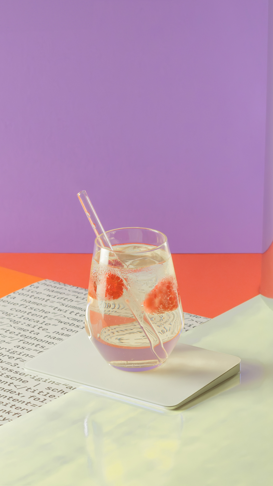

# Summer Coding

## Guide

starting off with the blank project, let's explain the structure and what we're about to build.

```
.
├── README.md // you're here
├── css // all our stylings go in this folder
│   └── style.css // preferrably this file
├── images // the images we're going to pick from, unless you want to upload your own. that image should also go here.
│   ├── picture.jpg
│   ├── picture.jpg
│   ├── picture.jpg
│   ├── ...
├── index.html // our landing page
├── js // everything that gives our page interactivity
│   └── script.js // you can ignore this for now
│   // ignore all of these
├── package.json
├── .prettierrc.json
├── sandbox.config.json
└── .there-be-dragons
```

### Semantic HTML

#### Explainer

- [Semantics](https://developer.mozilla.org/en-US/docs/Glossary/semantics)
- [`<section>`](https://developer.mozilla.org/en-US/docs/Web/HTML/Element/section)
- [order of headlines](https://developer.mozilla.org/en-US/docs/Web/HTML/Element/Heading_Elements#accessibility_concerns)
- [paragraphs in general](https://developer.mozilla.org/en-US/docs/Web/HTML/Element/p)

We want to use [landmarks](https://developer.mozilla.org/en-US/docs/Web/HTML/Element/main#landmark) like [`<main>`](https://developer.mozilla.org/en-US/docs/Web/HTML/Element/main#landmark) as descriptively as possible. Since the card is going to be our core functionality, this will be part of our main tag.

- HTML is short for `HyperText Markup Language`.
- It is giving content on websites `meaning and structure`. You can imagine HTML as the skeleton
  or the most basic building block of the Web.

Let's analyze the word for more
clarification:

- `Hypertext`: Refers to the ability of HTML to create links that link one webpage to another. (Either on a single website or in between different websites.) This is a fundamental aspect of the web and the idea behind the "world wide" interconnection.
- `Markup Language`: Refers to a syntax that uses specific elements to structure or format a document. You have maybe learned about a markup language, which is called "Markdown". While Markdown has a very simple syntax and is primarily used for formatting, HTML is more complex and its primarily used to structure a document.

- `HTML element`: Every piece of content in a HTML document is placed inside of an HTML element.
- `HTML tags`: The elements are written in form of HTML tags, meaning surrounded by `<>` and
  `</>`.
- `HTML attributes`: Some HTML elements need additional information in order to work properly. This information is given by HTML attributes.
- `local attributes`: There are attributes that are specific to some HTML elements, for example `src`, which only makes sense if a resource is supposed to be embedded into the webpage (e.g. images or videos).
- `global attributes`: There are also attributes that can be added to any kind of element. (e.g. `class`, `id`, `style`, `hidden`).

#### The benefits of writing semantic HTMl are:

- `Accessibility`: Screenreaders can function much better with semantic HTML, which can help e.g. visually impaired users to navigate the webpage and have a better user experience.
- `SEO`: It's relevant for search engines to evaluate the importance and the context of the different parts of a web page.
- `Readability`: It's easier for other developers to understand your code. And also for yourself in the future!

#### Coding

Write the base structure for the following tasks:

```html
<main>
  <section>
    <h1>Cocktail Party</h1>
    
  </section>
  <section>
    <h2>& du bist eingeladen!</h2>
    <h3>Wann?</h3>
    <p>08.07.2023, ab 18 Uhr</p>
    <h3>Wo?</h3>
    <p>In meinem Schrebergarten</p>
    <h3>Was gibts zu trinken?</h3>
    <ul>
      <li>UX on the Beach</li>
      <li>Daterol Spritz</li>
      <li>Java Libre</li>
      <li>Webasil Smash</li>
      <li>Dark & Cloudy</li>
    </ul>
    <p>
      Bitte gib mir bis zum 05.07. Bescheid, ob ich mit dir rechnen sollte.
    </p>
    <p>Cheers,</p>
    <p>Niklas</p>
  </section>
</main>
```

### Style fonts with own CSS classes

#### Explainer

CSS means Cascading Stylesheets. While HTML defines the structure and semantics of your content, we use CSS for design and layout.

- Selector: A CSS selector is used to specify the elements to which CSS rules apply.
- Property: Name for a particular property to which a value is attributed.
- Value: The value we assign to a property.
- Declaration: Each pair of property and value is a declaration.

We only show `.class` selectors to keep specificity simple at `(0,1,0)`.
if the participants want to overwrite styles, they should either edit the class or write add a new one, but keep them in order of how they want the styles to be applied.

#### Coding

Recommended stylings are:

- `h1` with

  ```css
  .headline {
    font-family: "LaBelleAurore";
    color: rgb(255, 255, 255);
  }
  ```

- either specific classes setting the `font-family` for all other text,
- OR let the styles cascade.

  ```css
  .card {
    font-family: "Krub";
  }
  ```

### Split into two sections

We need the predefined classes `.card`, `.front` and `.back` to be added to their respective tags in order to apply the global styles:

- `.card` aligns the content as expected
- `.front` creates a default background color, adds a padding and a box shadow for the card
- `.back` gets rotated and flipped to the back

```html
<main class="card">
  <section class="front">
    <h1 class="headline">Cocktail Party</h1>
    
  </section>
  <section class="back">
    <h2 class="heading">& du bist eingeladen!</h2>
    <h3 class="subheading">Wann?</h3>
    <p>08.07.2023, ab 18 Uhr</p>
    <h3 class="subheading">Wo?</h3>
    <p>In meinem Schrebergarten</p>
    <h3>Was gibts zu trinken?</h3>
    <ul>
      <li>UX on the Beach</li>
      <li>Daterol Spritz</li>
      <li>Java Libre</li>
      <li>Webasil Smash</li>
      <li>Dark & Cloudy</li>
    </ul>
    <p>
      Bitte gib mir bis zum 05.07. Bescheid, ob ich mit dir rechnen sollte.
    </p>
    <p>Cheers,</p>
    <p class="text highlighted">Niklas</p>
  </section>
</main>
```

> 💡 This _hides_ the back of the card. This might be surprising but is what we want.

### Implement flipcard functionality

#### Explainer

Click around and show that nothing happens.

To achieve this, we need to use a very small amount of JavaScript. JavaScript gives us the possibility to add interactivity to our card. In our case, we want our card to rotate when the map or the background is clicked.

We have already prepared the JavaScript for this and we don't need to write it ourselves. But for it to work we need to add a rule for another CSS class:

```css
.flipcard {
  transform: rotateY(180deg);
}
```

### Add static image from /images

Add image to the end of the `.front` section. Show that the order of the tags makes a significant difference.

Use one of the prepared images in `/images`.

```html

```

Explain `src` and `alt`

> 💡 Raise awareness about the importance of `alt` for accessibility!

> 💡 `.postcardimage` is a prepared global class that makes the image cover the front of the card. sets `object-fit: cover`.

This is a good chance to update the color of the `.headline` and add another class `.contrasted` with:

```css
.contrasted {
  text-shadow: 5px 4px rgb(67, 23, 104);
}
```

### Keep styling

- change colors
- change images
  - upload own images to codesandbox
  - Use random url `https://source.unsplash.com/random?cocktail`, tell them to keep in mind that this is an external resource.
- change text shadow
- update texts, add more paragraphs
- add small image to back?

## Credits

flamingo by <a href="https://unsplash.com/@vicko?utm_source=unsplash&utm_medium=referral&utm_content=creditCopyText">Vicko Mozara</a> on <a href="https://unsplash.com/photos/m82uh_vamhg?utm_source=unsplash&utm_medium=referral&utm_content=creditCopyText">Unsplash</a>

red-drink by <a href="https://unsplash.com/pt-br/@istepanoff?utm_source=unsplash&utm_medium=referral&utm_content=creditCopyText">Igor Stepanov</a> on <a href="https://unsplash.com/photos/rNKKUsIJNd4?utm_source=unsplash&utm_medium=referral&utm_content=creditCopyText">Unsplash</a>

strawberries-and-cocktail by <a href="https://unsplash.com/@greatcocktails?utm_source=unsplash&utm_medium=referral&utm_content=creditCopyText">Great

orange cocktail - Photo by <a href="https://unsplash.com/@norevisions?utm_source=unsplash&utm_medium=referral&utm_content=creditCopyText">No Revisions</a> on <a href="https://unsplash.com/photos/gA81ZTsql68?utm_source=unsplash&utm_medium=referral&utm_content=creditCopyText">Unsplash</a>

three-cocktails by <a href="https://unsplash.com/@whitney_wright?utm_source=unsplash&utm_medium=referral&utm_content=creditCopyText">Whitney Wright</a> on <a href="https://unsplash.com/photos/TgQkxQc-t_U?utm_source=unsplash&utm_medium=referral&utm_content=creditCopyText">Unsplash</a>

rose-lime - Photo by <a href="https://unsplash.com/@cceee?utm_source=unsplash&utm_medium=referral&utm_content=creditCopyText">Cody Chan</a> on <a href="https://unsplash.com/photos/tAN9f8-dPTM?utm_source=unsplash&utm_medium=referral&utm_content=creditCopyText">Unsplash</a>

garden-party - Photo by <a href="https://unsplash.com/@neonbrand?utm_source=unsplash&utm_medium=referral&utm_content=creditCopyText">Kenny Eliason</a> on <a href="https://unsplash.com/photos/LoV0EpSG2-M?utm_source=unsplash&utm_medium=referral&utm_content=creditCopyText">Unsplash</a>

two-palms by <a href="https://unsplash.com/@hertwashere?utm_source=unsplash&utm_medium=referral&utm_content=creditCopyText">Hert Niks</a> on <a href="https://unsplash.com/photos/U_A5wp3Ubnw?utm_source=unsplash&utm_medium=referral&utm_content=creditCopyText">Unsplash</a>

palms by <a href="https://unsplash.com/ko/@abuns?utm_source=unsplash&utm_medium=referral&utm_content=creditCopyText">Alex Bunday</a> on <a href="https://unsplash.com/photos/_MdUz-1Ofsg?utm_source=unsplash&utm_medium=referral&utm_content=creditCopyText">Unsplash</a>

two-cocktails by <a href="https://unsplash.com/@gbyz13?utm_source=unsplash&utm_medium=referral&utm_content=creditCopyText">Gaby Yerden</a> on <a href="https://unsplash.com/photos/3x2cFCoBeEQ?utm_source=unsplash&utm_medium=referral&utm_content=creditCopyText">Unsplash</a>
